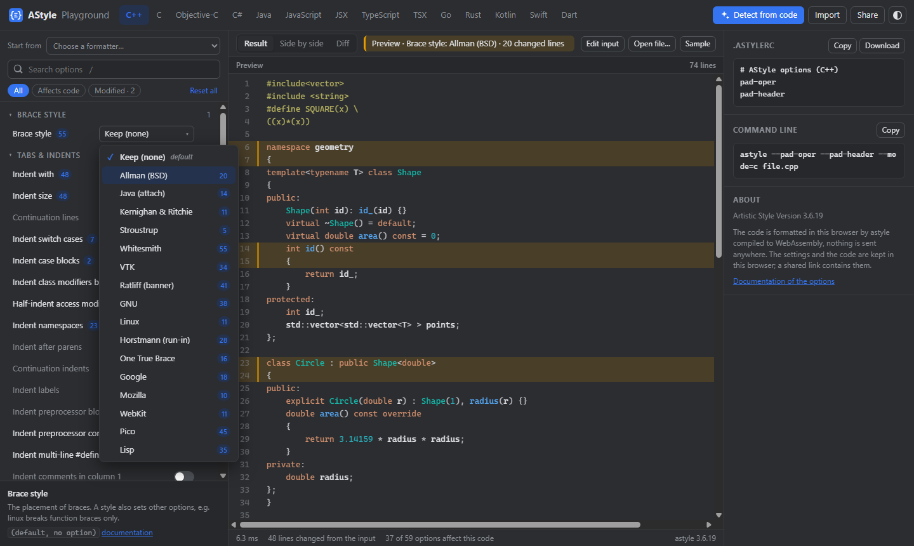

# AStyle

[](https://github.com/AdHoc-Protocol/AStyle/actions/workflows/playground.yml)
[](https://github.com/AdHoc-Protocol/AStyle/actions/workflows/release.yml)
[](https://github.com/AdHoc-Protocol/AStyle/releases/latest)
[](AStyle/LICENSE.md)

**One formatter for a polyglot codebase.** Artistic Style, the classic C/C++/C#/Java formatter, extended with
**TypeScript, JSX, Go, Rust, Kotlin, Swift, Dart and Scala**, and formatting every language the way its own community
formatter does. A single native executable without dependencies, for Linux, Windows and macOS, and a WebAssembly build.

<p align="center">
  <a href="https://adhoc-protocol.github.io/AStyle/"></a>
</p>

<p align="center">
  <b><a href="https://adhoc-protocol.github.io/AStyle/">▶ Open the style configurator</a></b><br>
  Pick a language, hover an option to see what it changes in the code, detect the style of your own code,
  copy the <code>.astylerc</code>. It runs in your browser, the code is not sent anywhere.
</p>

- [Languages](#languages)
- [Examples](#examples)
- [Install](#install)
- [Usage](#usage)
- [The style configurator](#the-style-configurator)
- [Build](#build)
- [What is new in this fork](#what-is-new-in-this-fork)
- [Tests](#tests)
- [Credits and license](#credits-and-license)

## Languages

| Language | Mode | Suffixes | Formatted like |
|---|---|---|---|
| C, C++, C++/CLI | `c` | `.c .h .cpp .hpp .cc .cxx` ... | Artistic Style 3.6.19, byte for byte |
| Objective-C | `objc` | `.m .mm` | Artistic Style 3.6.19, byte for byte |
| C# | `cs` | `.cs` | Rider, with the modern C# syntax |
| Java | `java` | `.java` | Artistic Style, with records, text blocks, arrow switch labels |
| JavaScript, JSX | `js`, `jsx` | `.js .mjs .cjs .jsx` | Prettier |
| TypeScript, TSX | `ts`, `tsx` | `.ts .mts .cts .tsx` | Prettier |
| Go | `go` | `.go` | gofmt |
| Rust | `rust` | `.rs` | rustfmt |
| Kotlin | `kotlin` | `.kt .kts` | ktlint |
| Swift | `swift` | `.swift` | swift-format |
| Dart | `dart` | `.dart` | dart format |
| Scala 2, Scala 3 | `scala` | `.scala .sc .sbt` | IntelliJ Scala plugin |

The language comes from the file suffix, also for `--stdin=`, or from `--mode=`.
The other options work for every language: the brace styles, the indentation, the padding, the blank lines,
the line length.

## Examples

The input on the left, `astyle` on the right.

**JSX**, `--indent=spaces=2`: the elements are indented by their structure, as Prettier does

<table>
<tr>
<td>

```jsx
export const List = ({items}) => (
<ul>
{items.map(item => (
<li key={item.id}
onClick={() => select(item)}>
{item.name}
</li>
))}
</ul>
);
```

</td>
<td>

```jsx
export const List = ({items}) => (
  <ul>
    {items.map(item => (
      <li key={item.id}
        onClick={() => select(item)}>
        {item.name}
      </li>
    ))}
  </ul>
);
```

</td>
</tr>
</table>

**C#**, `--style=allman --pad-oper`: switch expressions, auto-properties kept on one line

<table>
<tr>
<td>

```csharp
public decimal Discount(Order o) => o switch {
{ Total: > 1000 } => o.Total*0.1m,
{ Vip: true } => 50,
_ => 0
};
public string Name { get; set; }
```

</td>
<td>

```csharp
public decimal Discount(Order o) => o switch {
    { Total: > 1000 } => o.Total * 0.1m,
    { Vip: true } => 50,
    _ => 0
};
public string Name { get; set; }
```

</td>
</tr>
</table>

**Go**, `--indent=force-tab`: as gofmt, composite literals `{{` add one indent

<table>
<tr>
<td>

```go
func main() {
if err := run(); err != nil {
log.Fatal(err)
}
tests := []struct{ in, want string }{{
in: "a",
want: "A",
}}
}
```

</td>
<td>

```go
func main() {
	if err := run(); err != nil {
		log.Fatal(err)
	}
	tests := []struct{ in, want string }{{
		in: "a",
		want: "A",
	}}
}
```

</td>
</tr>
</table>

More examples of every language are in the [documentation](https://adhoc-protocol.github.io/AStyle/doc/astyle.html#_Languages).

## Install

Download the archive of your platform from the [latest release](https://github.com/AdHoc-Protocol/AStyle/releases/latest)
and put `astyle` (`astyle.exe`) in your `PATH`:

| Platform | File |
|---|---|
| Linux x64, arm64 | `astyle-<version>-linux-x64.tar.gz`, `astyle-<version>-linux-arm64.tar.gz` |
| Windows x64, arm64 | `astyle-<version>-windows-x64.zip`, `astyle-<version>-windows-arm64.zip` (no Visual C++ runtime needed) |
| macOS, Apple silicon and Intel | `astyle-<version>-macos-universal.tar.gz` |
| WebAssembly | `astyle-<version>-wasm.zip`: `astyle.wasm` and its loader for browsers and Node.js |

`SHA256SUMS` lists the checksums of the files. Every binary is tested on its platform before a release.

`astyle` is a command line program. Started without arguments, e.g. by a double click, it shows how to use it.

## Usage

```sh
astyle --style=allman --pad-oper src/*.cpp        # formats the files in place, keeps .orig backups
astyle --suffix=none --recursive "src/*.ts"       # all the TypeScript files of the directory tree, no backups
astyle --mode=rust < main.rs > formatted.rs       # a filter: the language from --mode
astyle --dry-run --error-on-changes -R "*.go"     # in a CI: fails if a file is not formatted
astyle --help
```

The options can also be in an option file, one per line without the dashes, e.g. from the configurator:

```ini
# .astylerc
style=java
indent=spaces=2
pad-oper
pad-header
```

The default option file is `$HOME/.astylerc` (`%APPDATA%\astylerc` on Windows). With `--project`, the option file
`.astylerc` of the top directory of the project is used. The
[documentation](https://adhoc-protocol.github.io/AStyle/doc/astyle.html) describes every option.

## The style configurator

[The configurator](https://adhoc-protocol.github.io/AStyle/) shows how the options format the code of every language:

- **hover to preview**: hovering an option, or a value of a list, shows the code formatted with it, the changed lines highlighted;
- **the effect on your code**: every option and every value shows how many lines it changes, "Affects code" hides the others;
- **detect from code**: finds the options that keep your code as it is, as "Detect code style" of Rider;
- **start from** the settings of Prettier, Rider, IntelliJ, Google, Linux, gofmt or rustfmt;
- the result, side by side, or a diff; paste or open your own code;
- the `.astylerc` and the command line, to copy or download; import of an option file or a command line;
- a link to share the settings and the code.

astyle runs in the page as WebAssembly: the configurator is a static site, nothing is installed and the code
stays in your browser.

### On your computer

To use the configurator without an internet connection, only [Node.js](https://nodejs.org) 18+ is needed, as a local
web server (the browsers do not run the WebAssembly of a page opened as a file):

1. download `astyle-playground-<version>.zip` from the [latest release](https://github.com/AdHoc-Protocol/AStyle/releases/latest) and unpack it;
2. run `node serve.js` in it;
3. open http://127.0.0.1:8080/.

Any static web server works as well, the directory is the whole site.

### From the sources

To try changes of astyle in the configurator, build astyle for WebAssembly. Nothing is installed, the archives of
[wasi-sdk](https://github.com/WebAssembly/wasi-sdk/releases) are only unpacked:

```sh
# the full SDK with its own clang, e.g. wasi-sdk-34.0-x86_64-windows.tar.gz, -x86_64-linux, -arm64-macos
WASI_SDK_ROOT=../wasi-sdk/wasi-sdk-34.0-x86_64-windows sh web/wasm/build.sh
# or with an installed clang 21+: wasi-sysroot-34.0.tar.gz and libclang_rt-34.0.tar.gz unpacked in ../wasi-sdk
sh web/wasm/build.sh

node web/server.js        # http://127.0.0.1:8080/, the page is served from web/public, a reload shows the changes
node web/build-site.js    # the static site in web/dist, as it is published
```

Instead of building it, `astyle.wasm` of `astyle-<version>-wasm.zip` can be copied to `web/public/`.
[`web/README.md`](web/README.md) describes the configurator, its structure and its tests.

## Build

A C++17 compiler is all it needs:

```sh
g++ -std=c++17 -O2 AStyle/src/*.cpp -o astyle                  # or clang++
cl /O2 /EHsc /std:c++17 /utf-8 /MT AStyle\src\*.cpp /Fe:astyle.exe shell32.lib
cmake -S AStyle -B build && cmake --build build
```

There are also the Makefiles of `AStyle/build/{gcc,clang,intel,mac}`, the Visual Studio 2022 projects of
`AStyle/build/vs2022` and the Xcode projects of `AStyle/build/xcode`.

## What is new in this fork

Compared to Artistic Style 3.6.19:

- **A lexer pass** (`AStyle/src/ASLexer.cpp`) protects every literal: template literals, regular expressions, JSX, raw,
  verbatim and interpolated strings, text blocks, Rust lifetimes, multi-line strings. It recognizes the statements
  ended by a line break (JavaScript, TypeScript, Go, Kotlin, Swift, Scala) and the conditions without parens (Go, Rust,
  Swift, Scala).
- **The new languages**: TypeScript/TSX, JSX, Go, Rust, Kotlin, Swift, Dart and Scala, with the modes `ts`, `tsx`,
  `jsx`, `go`, `rust`, `kotlin`, `swift`, `dart`, `scala`.
- **Scala 3 significant indentation**: the indentation regions of Scala 3 (`if ... then`, `match`, `def f =`, `object A:`,
  `xs.map: x =>`, `end` markers) are indented like blocks, re-indenting keeps the meaning of the code. Scala 2 code with
  braces is formatted as always. `--pad-type-colon=after|all|none` sets the spaces around a type colon, as the
  IntelliJ Scala plugin does.
- **Alignment in columns, every language**: `--align-declarations` (modifiers, type, name, initializer and comment of
  consecutive declarations, as "Align fields in columns" of IntelliJ), `--align-assignments` and `--align-comments`.
- **Rewriting, as scalafmt does**: `--sort-imports`, `--sort-modifiers`, `--trailing-commas=always|never`, and for
  Scala 3 `--scala3-syntax` (`if (a) b` becomes `if a then b`) and `--scala3-end-markers=#` (`end f` after a long
  `def f =`).
- **`--block-continuation` / `--align-continuation`**: continuation lines one indent from the statement, as Prettier and
  gofmt do (the default for JavaScript, TypeScript and the new languages), or aligned with a paren or an assignment.
- **C#**: switch expressions, records, `with` and `new` initializers, one-line auto-properties and accessors, raw strings.
- **JavaScript and TypeScript**: object literals, arrow functions, type annotations, `===`, `??=`, `?.`, `**`, `...`,
  keywords used as property names; JSX re-indented by its structure.
- **Generics spanning lines** (`fn f<` ... `>(`) are indented like parens; Go composite literals `[]T{{` and Rust macros
  `=> {{` add one indent only.
- **Java**: arrow case labels (`case 1 -> {`, `default ->`), text blocks, compact record constructors.
- **The library builds** also parse `squeeze-ws`, `preserve-ws`, `pad-brackets` and `indent-lambda`.
- **A welcome**: `astyle` started without arguments, e.g. by a double click, shows how to use it, in color, instead of
  waiting silently for the input. `NO_COLOR` turns the colors off.
- **The documentation** ([online](https://adhoc-protocol.github.io/AStyle/doc/astyle.html), `doc/` of a release): a dark
  theme, the examples highlighted with the lines every option changes, the languages with examples.

C, C++ and Objective-C are formatted exactly as by Artistic Style 3.6.19.

## Tests

```sh
node tests/run-tests.js                # the golden files of tests/cases, every language
sh tests/tools/check-all.sh            # and the corpus checks
node web/test/wasm-compare.js          # the WebAssembly build formats as the native program
```

The corpus checks compare C/C++ with an upstream build byte for byte, the tokens of C# with Roslyn and of TypeScript
with the TypeScript parser, and check that formatting twice changes nothing.
The workflows run the golden tests, the WebAssembly comparison and the configurator in headless Chrome on every push.

## Credits and license

Artistic Style was written by Tal Davidson, maintained by Jim Pattee and now by André Simon:
<https://astyle.sourceforge.net>, <https://gitlab.com/saalen/astyle>.
This fork is released under the same [MIT License](AStyle/LICENSE.md).
